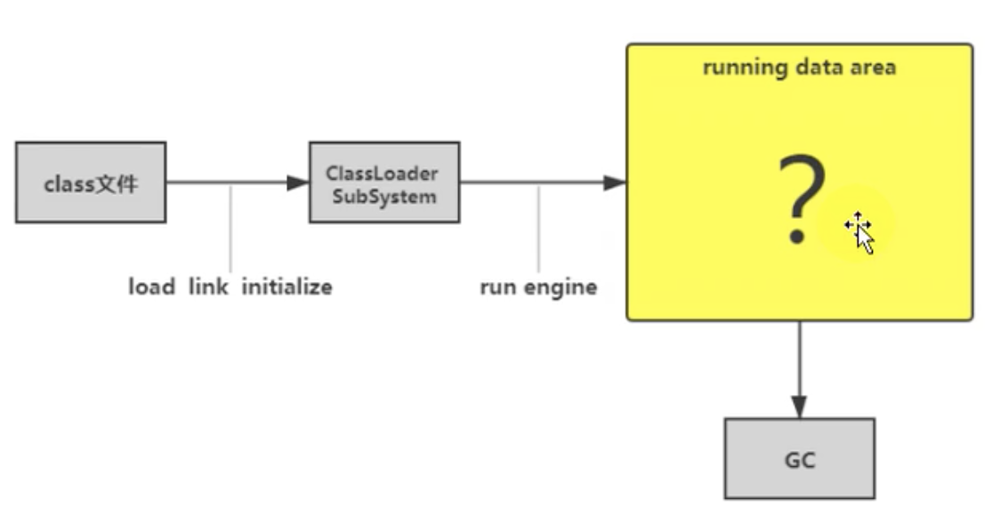
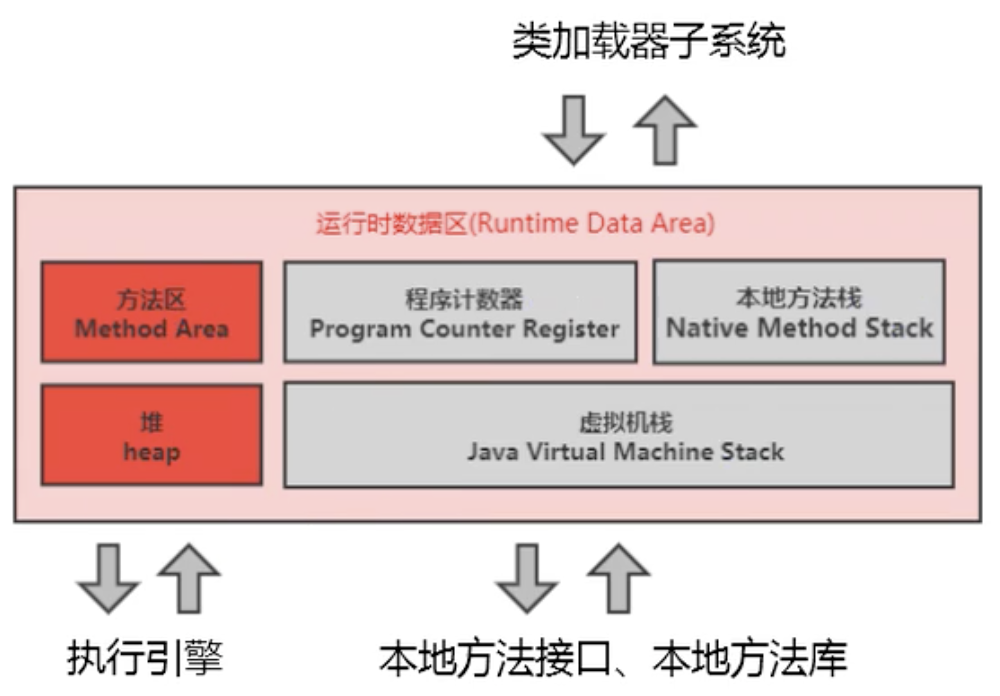
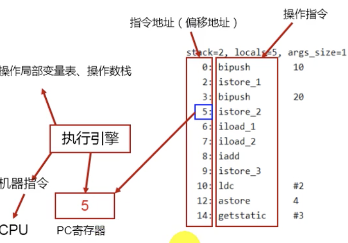
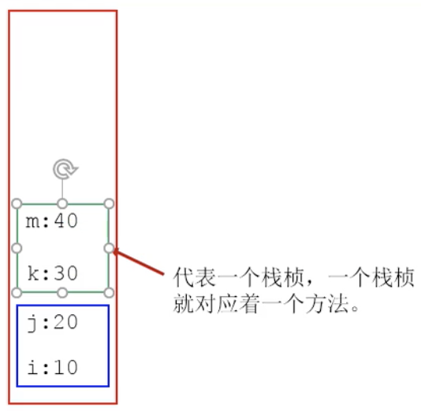
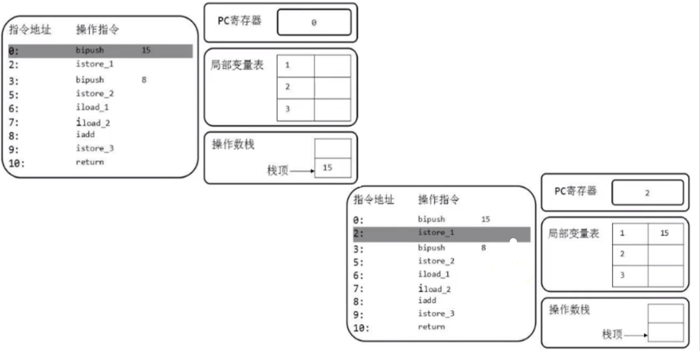
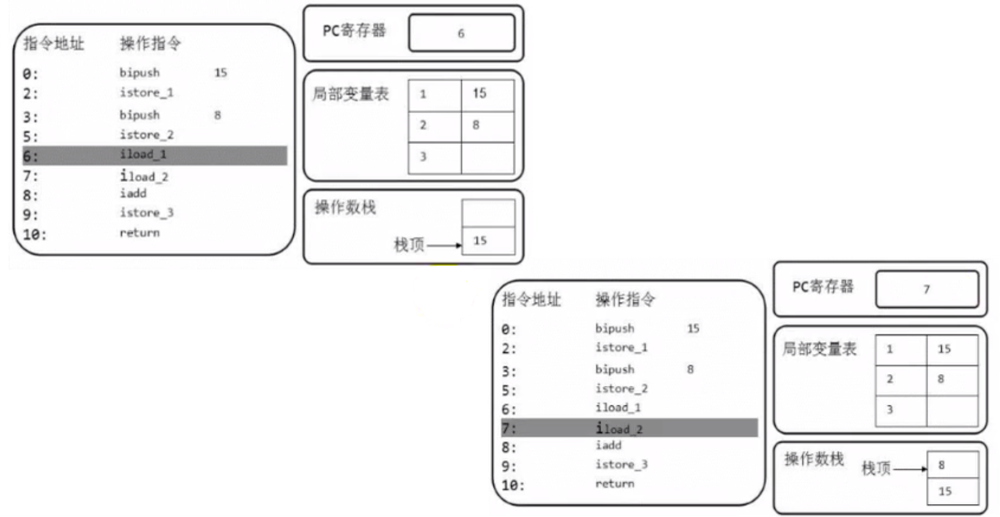
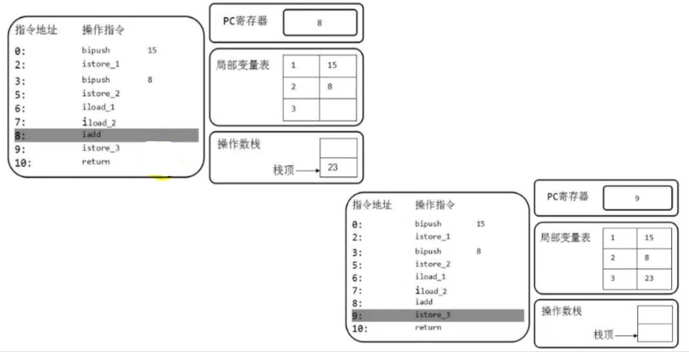
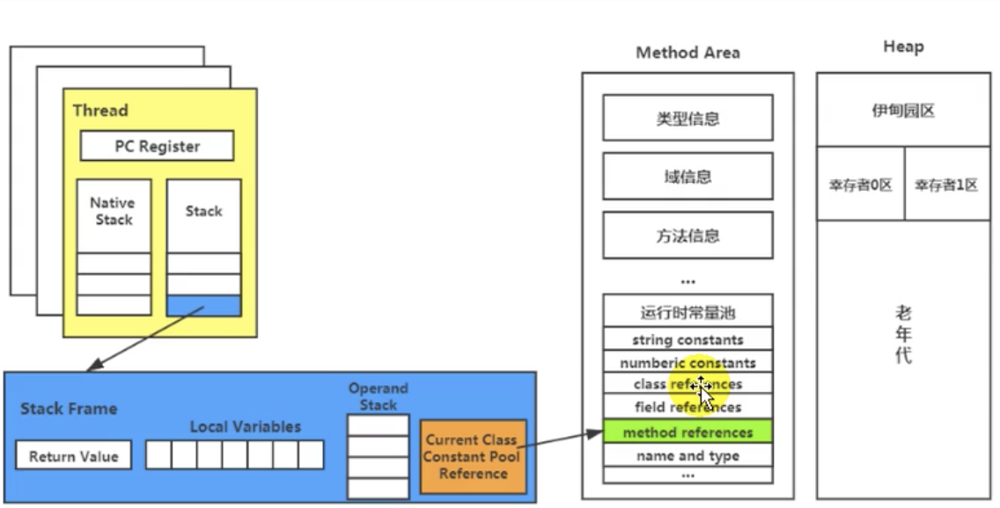

回顾一下上一讲, class文件被类加载器加载之后, 会使用run engine去执行.
<!-- more -->


Running Data Area具体内容如下图, 红色部分是多个线程共享的, 灰色部分是线程私有的. 一个JVM只有一个Area(只有一个Runtime实例).


## 线程
在HotSpot JVM, 每个线程都与操作系统的本地线程直接映射. 当一个java线程准备好执行以后，此时一个操作系统的本地线程也同时创建. java线程执行终止后. 本地线程也会回收. 操作系统负责所有线程的安排调度到任何一个可用的CPU上, 一旦本地线程初始化成功, 它就会调用java线程中的run()方法.

主要的后台线程有: 虚拟机线程, 周期任务线程, GC线程, 编译线程和信号调度线程.

## Program Counter Register(PC寄存器)
PC寄存器的作用是存储指向下一条指令的地址, 由执行引擎读取下一条指令. 从字节码的角度看如下图, PC寄存器读取到5, 被执行引擎读取后来操作栈结构, 把自己饿吗指令翻译成机器指令, 机器指令就可以让对应的CPU做运算. 


那么使用PC寄存器存储字节码指令地址有什么用呢? 为什么使用PC寄存器记录当前线程的执行地址呢? 因为CPU在不同的线程之间切换, 切换回来后要知道从哪里开始继续执行该线程, JVM的字节码解释器就需要通过改变PC寄存器的值来明确下一条应该执行什么样的字节码指令. PC寄存器为什么会设定为线程私有? 道理相同, 每个线程要知道在自己线程中执行到那一个字节码指令, PC寄存器能够准确地记录各个线程正在执行的当前字节码指令地址.

## JVM Stack(虚拟机栈)
由于跨平台性的设计, java的指令都是根据栈来设计的. 优点是跨平台, 指令集小, 编译器容易实现; 缺点是性能下降, 实现同样的功能需要更多的指令. 

栈是运行时的单位, 而堆是存储的单位. 一般来讲, 对象主要放在堆空间. 栈空间存放基本数据类型的局部变量和引用数据类型的对象的引用. JVM Stack生命周期和线程是一致的, 主管java程序的运行, 它保存方法的局部变量(8种基本数据类型, 对象的引用地址), 部分结果, 并参与方法的调用和返回. 内部保存的是**Stack Frame**, 因为只需要出栈入栈操作, 所以它的速度仅次于PC寄存器, 并且不需要GC.


java虚拟机规范允许Java栈的大小是动态的或者是固定不变的, 相对的如果JVM栈固定, 线程请求分配的栈容量超过jJVM栈允许的最大容量, 就会出现熟悉的StackOverFlowError. 如果如果JVM栈可以动态拓展, 但是在尝试拓展的时候无法申请到足够的内存, 就会出现熟悉的OutOfMemoryError. 对于栈的大小可以通过-Xss来设置, 可以通过下面的代码来测试, 改变Xss, 在StackOverFlowError出现后看count的值也会跟着变化. 
```
public class StackErrorTest {
    private static int count = 1;
    public static void main(String[] args) {
        System.out.println(count);
        count++;
        main(args);
    }
}
```
在一条活动线程中, 一个时间点上, 只会有一个活动的栈帧, 即只有当前正在执行的方法的栈帧(栈顶栈帧)是有效的, 这个栈帧被称为当前栈帧(Current Frame), 与当前栈帧对应的方法就是当前方法(Current Frame). Java方法有两种返回函数的方式, 一种是正常的函数返回, 使用return指令, 另外一种是抛出异常, 不管使用哪种方式, 都会导致栈帧被弹出.

### Stack Frame(栈帧)
栈帧的内部存储了
- **局部变量表Local Variables**
- **操作数栈Operand Stack**
- 动态链接Dynamic Linking
- 方法返回地址Return Adress
- 一些附加信息

下面一一讲解.

#### 局部变量表
局部变量表定义为一个数字数组，主要用于存储方法参数和定义在方法体内的局部变量. 这些数据类型包括**各类基本数据类型**, **对象引用**, 以及**returnAddress类型**; 线程私有; 容量大小是在编译期确定下来的; 可以在idea中通过查看字节码看方法中的Maximum Local Varialbe来查看具体大小.
```
public static void main(String[] args) {
    LocalVariablesTest test = new LocalVariablesTest();
    int num = 10;
    test.test1();
}
```


局部变量表最基本的存储单元是**Slot**. 在局部变量表里，32位以内的类型只占用一个slot(包括returnAddress类型)，64位的类型(long和double)占用两个slot. 可以从Index看出.

- byte, short, char, float在存储前被转换为int.

- boolean也被转换为int, 0表示false, 非0表示true;

当一个实例方法被调用的时候，它的方法参数和方法体内部定义的局部变量将会按照顺序被复制到局部变量表中的每一个slot上

如果需要访问局部变量表中一个64bit的局部变量值时, 只需要使用前一个索引即可. (比如访问long或者double类型变量)
 
如果当前帧是由**构造方法或者实例方法创建**的, 那么该对象引用this将会存放在index为0的slot处, 其余的参数按照参数表顺序排列.

slot是可以重复利用的. 如下图c的index用了之前b的slot, 所以都为2. 


> 补充: 变量分类
> 数据类型分: 基本数据类型, 引用数据类型.
> 
> 按照在类中声明的位置分:
> 
> 1.成员变量(在使用前都经过默认初始化赋值): static类变量(linking的prepare阶段默认赋值, initial阶段显式赋值); 实例变量(随着对象创建, 在堆空间中分配实例变量空间, 并进行默认赋值).
> 
> 2.局部变量: 在使用前必须显式赋值.

**局部变量表中的变量也是重要的垃圾回收根节点, 只要被局部变量表中直接或间接引用的对象都不会被回收; 在栈帧中, 与性能调优关系最为密切的部分就是局部变量表**.

#### Operand Stack(操作数栈)
可以使用数组或者链表来实现. 操作数栈在方法执行过程中**根据字节码指令**, 往栈中写入数据(push)或提取(pop)数据. 主要用于保存计算过程的中间结果, 同时作为计算过程中变量临时的存储空间. 32bit的类型占用一个栈单位深度, 64bit的类型占用两个栈深度单位.

**如果被调用的方法带有返回值, 其返回值将会被压入当前栈帧的操作数栈中**, 并更新PC寄存器中下一条需要执行的字节码指令. 

我们说JVM的**解释引擎是基于栈的执行引擎**, 其中的栈指的就是操作数栈.

下图就是代码的一系列操作对应的字节码治指令及栈的相关操作. 
```
public void testAddOperation {
    byte i = 15;
    int j = 8;
    int k = i + j;
}
```




这里我们发现push到操作数栈的时候, 都是基于byte的bipush, 因为数字都在byte范围内, 但是存储到局部变量表之后就变成了int.

#### Dynamic Linking(动态链接)
每一个栈帧内部都包含一个指向运行时常量池或该栈帧所属方法的引用. 在Java源文件被编译成字节码文件中时, 所有的变量和方法引用都作为符号引用(symbolic Refenrence)保存在class文件的常量池里. 目的就是提供一些符号和常量, 便于指令的识别.


## 方法的调用
**方法的调用**是我们每天都会用到的, 下面先介绍这一点, 再接着讲栈帧的其他部分.

在JVM中，将符号引用转换为调用方法的直接引用与方法的绑定机制相关.

**静态链接**: 被调用的目标方法在编译期可知, 且运行期保持不变; **动态链接**: 被调用的方法在编译期无法被确定下来, 只能够在程序运行期将调用方法的符号引用转换为直接引用.