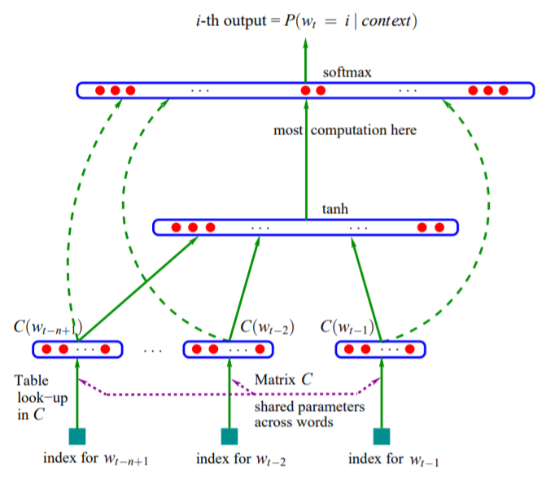
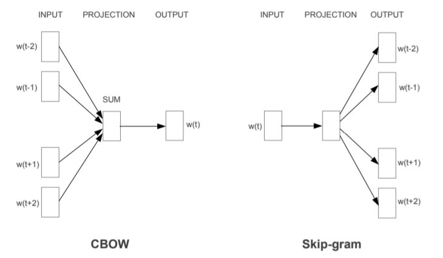
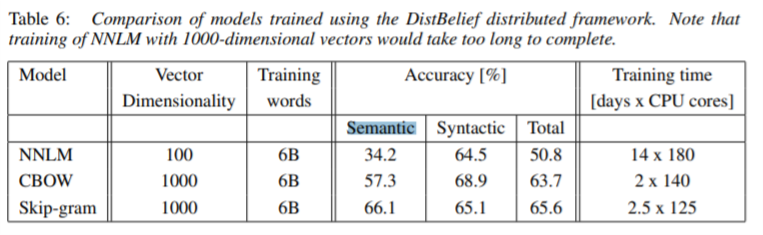

名叫word2vec, 其实是指代CBOW和skip-gram这两种结构的模型. Mikolov的原论文分析的非常简单, 看原论文能理解几乎是不可能的, 所以我打算用两篇论文来分别总结word2vec.
<!-- more -->

## 为啥做
第一点是为了encode文字信息, 第二点其实就是在前有的模型上进行提高. 比如**NNLM**[2]这样的模型的问题就是太复杂. NNLM结合了语言模型和神经网络, 输入就是$w_{t}$之前的n-1个词, 通过矩阵C mapping到词向量上, 把这些向量拼接在一起经过tanh再经过softmax就可以映射到概率分布. word features C这个矩阵最后就保存了训练得到的词向量. 所以它的计算复杂度是$Q = N\times D + N\times D\times H + H\times V$. N就是前面出现的N个previous words, $N\times D$就是输入层转化的那个a shared projection matrix. hierarchical softmax可以解决最后的$H\times V$产生的复杂度, 所以现在想要化简的是中间$N\times D\times H$产生的计算.

## 咋做的
对比NNLM最直观的变化就是从只考虑前面出现的词这样的语言模型转化成了考虑上下文的模型, 而且非线性层被去除了, 这就简化了计算, CBOW中输入的词向量共享同一个projection layer, 训练的复杂度是$N\times D + D\times \log_{2}(V)$, skip-gram和CBOW类似, 不过是用中间的词预测前后的词, 它的训练复杂度是$C\times (D + D\times \log_{2}(V))$, 其中C是单词的最大距离, 也就是在训练时选取距离内的部分词进行训练.

## 有了啥
训练出的词向量较之前在大大减少的训练时间的情况下, 准确率有了很大的提升.

而且词向量就可以被用来做运算, 下面是用gensim做了一个相似度计算.

'''python
    model.most_similar(positive=['woman', 'king'], negative=['man'])
    [('queen', 0.7698541283607483), ('monarch', 0.6843380928039551), ('throne', 0.6755737066268921)]
'''

## REFERENCES
[1] **Efficient Estimation of Word Representations in Vector Space**. Tomas Mikolov, Kai Chen, Greg Corrado, Jeffrey Dean.[paper](https://arxiv.org/pdf/1301.3781.pdf)

[2] **A Neural Probabilistic Language Model**. Yoshua Bengio, Réjean Ducharme, Pascal Vincent, Christian Jauvin. [paper](http://www.jmlr.org/papers/volume3/bengio03a/bengio03a.pdf)