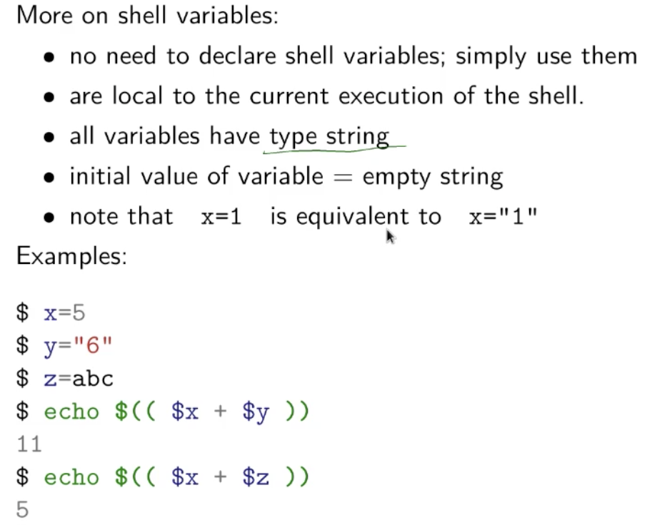
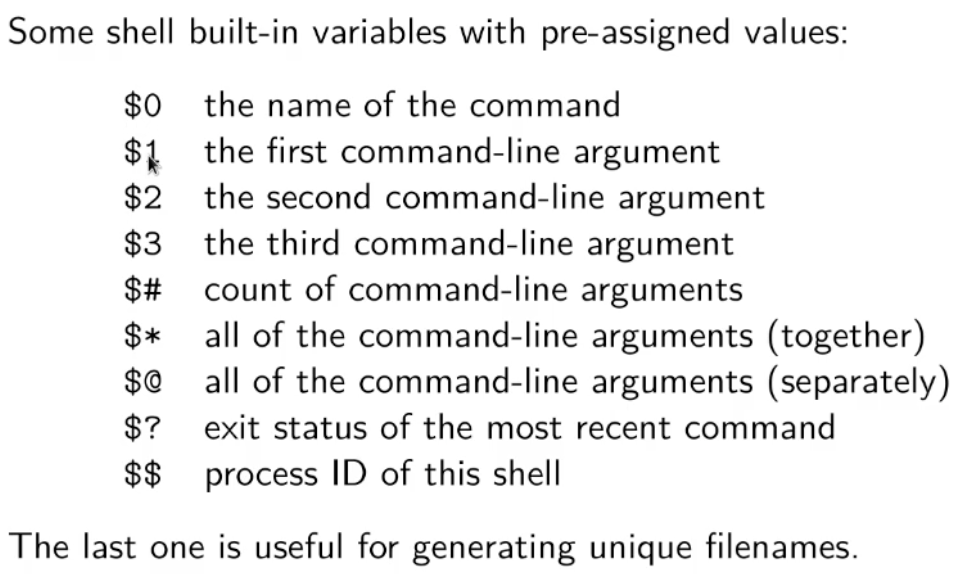

shell script第一行一般会写#!/bin/sh, 去让计算机知道这段代码不是machin code, 而是shell script. 在Bash中也可以吧sh替换成bash, python中替换成python. 这样就可以直接通过./来运行脚本了.
<!-- more -->
  
运行时可能发现我们被permission denied, 这个时候可以用ls -l看我们对这个文件的权限是什么, 然后再用chmod来为文件修改权限.

shell在某种程度上来说是typeless的. 输出的时候一般用echo.

下面是一些variable的解释.

shell的语法其实在[runoob](https://www.runoob.com/linux/linux-shell.html)
上有很好的总结, 我们使用的时候主要是要注意shell和一般的程序语言的区别. 比如不要随便用空格, 在用等号时我们会习惯性地写空格, 这在shell中就会造成错误. 
除了上面的$系列的command输入变量之外(也可以指已经定义的变量), shell也支持数组, 字符串等类和while, if等流程控制的语法, **echo**的作用和print类似, 打印字符串, 变量等内容. **expr**是计数器, 可以计算字符串长度, 或者做简单的加减乘除.

下面补充一些命令

- shell command也可以直接进行网络请求, 比如curl和wget. curl有很多的features, 相对好用一点, man crul可以看到curl有很多的操作. 比如curl -O可以下载对应url的文件. 
- find可以打印directory tree. 
- xargs一般是和管道一起使用, 可以读取输入并格式化后出输出.
